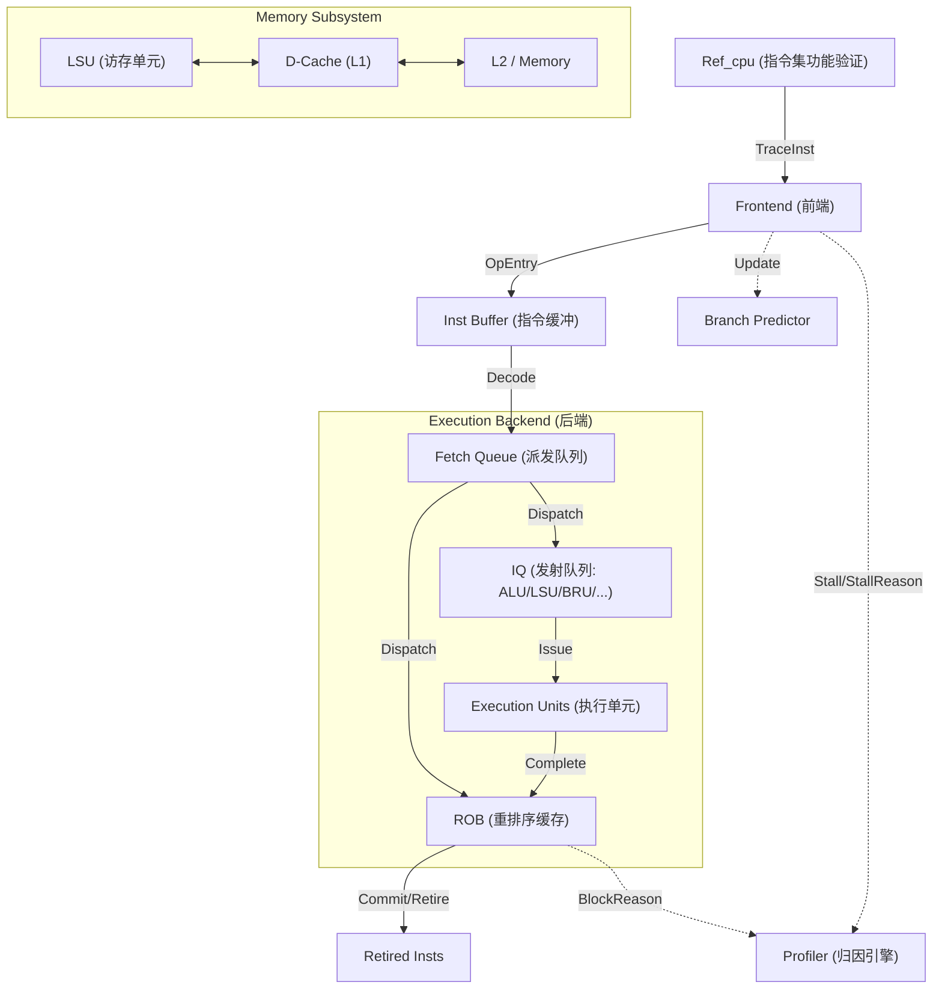

# TraceSim 模块化流水线架构

本文档详细介绍了 TraceSim 的物理模块拆分以及指令在各级流水线中的生命周期。

## 1. 整体拓扑 (Pipeline Overview)

## 2. 核心模块说明

### 2.1 Frontend (前端)
- **职责**: 负责从 `Ref_cpu` 获取原始指令追踪，并将其封装为内部使用的 `OpEntry`。
- **关键逻辑**:
    - **Cache Line Check**: 模拟 I-Cache 的访问延迟。
    - **Branch Prediction**: 集成了可插拔的预测器（如 Gshare）。
    - **Stall Logic**: 当发生 I-Cache Miss 或分支误预测时，通过 `sim.set_fetch_stall()` 阻止后续指令进入。

### 2.2 TraceSim (主控类/后端)
- **职责**: 维护 ROB、管理寄存器依赖关系（Ready Time）、控制指令派发。
- **宽度解耦**:
    - `dispatch_width`: 控制每周期从 `fetch_queue` 移入 `rob` 的指令上限。
    - `commit_width`: 控制每周期从 `rob` 头部退休的指令上限。

### 2.3 LoadStoreUnit (访存子系统)
- **职责**: 建模内存访问的时序，处理复杂的 Store/Load 依赖。
- **Store-to-Load Forwarding (STLF)**: 采用 $O(1)$ 的追踪机制。当 Load 指令进入 LSU 时，它会检查所有较早且未提交的 Store 指令是否存在地址重合。

### 2.4 Profiler (归因引擎)
- **职责**: 每周期监控流水线各级的“压力点”，并根据物理事实（如：这一拍有没有退休？后端有没有指令正在等内存？）进行 Top-down 归因建议。

## 3. 指令生命周期

1. **Fetch**: 从 Ref_cpu 获得指令，设置 PC 并分配 `entry_id`。
2. **Decode/Rename**: 将指令存入 `fetch_queue`。
3. **Dispatch**: 同步进入 `ROB` (维护顺序) 和 `IQ` (用于乱序发射)。
4. **Issue**: 当操作数 `reg_ready_time <= total_cycles` 且执行单元有空闲时，指令从 IQ 弹出并开始执行。
5. **Execute**: 占用执行单元指定的 Latency。如果是 Load 且 Miss，则进入长延迟等待。
6. **Commit**: 只有当 ROB 顶部的指令已执行完毕，且不晚于当前时钟时，指令才最终退休并统计入 IPC。

---
> [!NOTE]
> TraceSim 采用 **在线追踪** 模式，这意味着 `Ref_cpu` 的 step 操作是按需（Lazy）触发的，这极大节省了存储压力并支持无限长的程序仿真。
