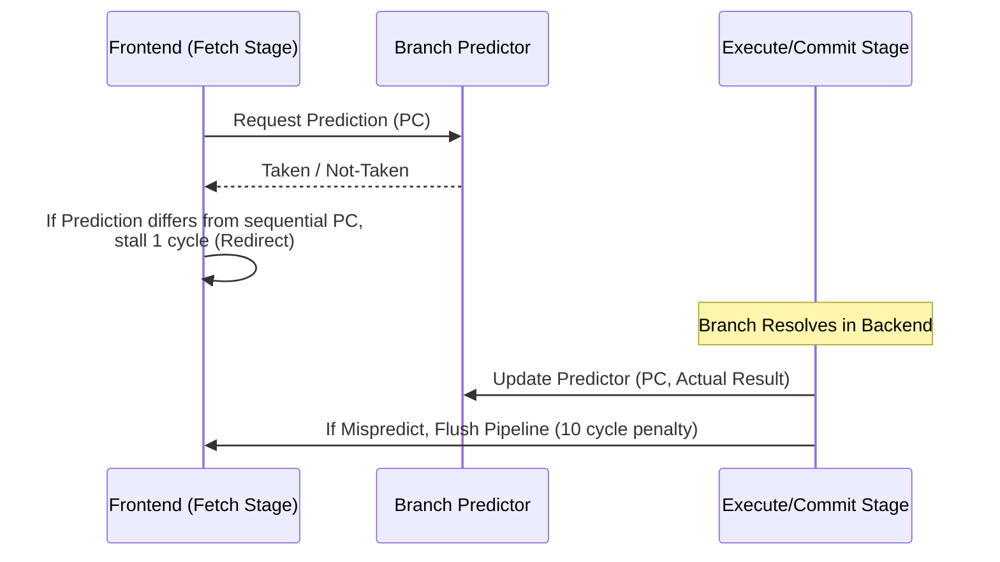

# TraceSim 分支预测 (BPU) 研究手册

分支预测器性能是实现高 IPC 的关键。TraceSim 将分支预测逻辑深度集成在 `Frontend` 模块中，并支持乱序执行环境下的异步更新。

## 1. 预测与更新流程

## 2. 内置算法

### 2.1 GShare Predictor
- **逻辑**: 使用全局历史寄存器 (GHR) 与分支 PC 进行异或 (XOR) 后索引模式历史表 (PHT)。
- **状态机**: PHT 存储 2-bit 饱和计数器（Strongly/Weekly Taken/Not-Taken）。
- **优势**: 能捕捉到指令间的相关性，适合 Dhrystone 等具有模式规律的 benchmark。

### 2.2 Probabilistic Predictor
- **逻辑**: 一个理想混合模型，支持手动设置 `BP_TARGET_ACCURACY`。
- **用途**: 用于快速扫描不同准确率对整体 IPC 的敏感性（Sensitivity Analysis），无需编写复杂的硬件算法。

## 3. 性能归因判据

BPU 的表现直接体现在 Profiler 的两个指标上：
- **Accuracy**: 基础预测准确率。
- **Bad Speculation**: 由于预测错误导致的无效周期占比。

> [!NOTE]
> **延迟区分**：正确预测的 Taken 分支仅导致 1 周期的 `FETCH_REDIRECT` 重定向延迟；而预测错误的分支则会引发 10 周期的 `BRANCH_MISPREDICT` 惩罚。

## 4. 研究方向
1. **BTB (Branch Target Buffer)**: 当前模拟器假设 BTB 始终命中，未来可以引入容量受限的 BTB 建模。
2. **多级预测器**: 实现类似 **TAGE** 的复杂预测架构，研究其对长依赖分支流的覆盖效果。

---
> [!WARNING]
> 分支预测器的更新逻辑目前位于 Fetch 阶段（在线 Trace 优势），在真实的流水线中更新通常发生在执行级。研究高级 BPU 时需注意由于更新延迟（Update Lag）导致的预测漂移。
