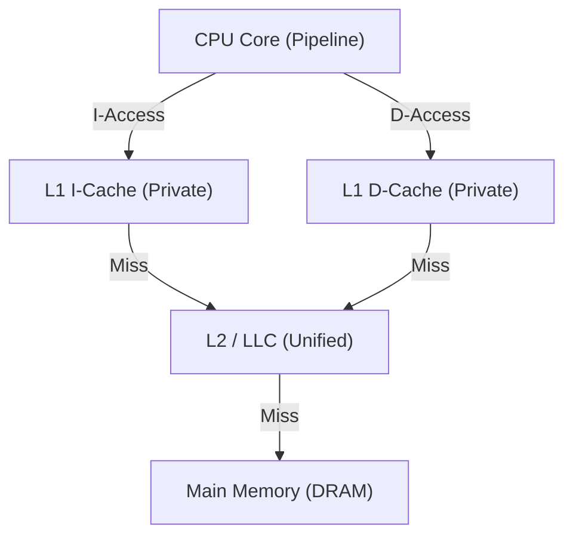

# TraceSim 缓存层次与替换策略说明

本模拟器实现了一个参数化、循环精确的存储层次模型，支持非阻塞访问（Non-blocking Access）和可插拔的替换算法。

## 1. 存储层次拓扑

## 2. 缓存建模细节

### 2.1 组织形式
- **Set-Associative**: 支持 N 路组相联配置（通过 `SimConfig.h` 设置）。
- **Line Size**: 默认 64 字节，为后端访存的基本单位。
- **MSHR (In-flight Requests)**: 采用了内部 `unordered_map<uint32_t, InflightRequest>` 管理在途请求，支持 Demand 和 Prefetch 的请求合并（Merge）。

### 2.2 当前替换策略：LRU (Least Recently Used)
当前每个 `CacheLine` 包含一个 `last_access` 时间戳。
- **命中 (Hit)**：更新该 Line 的 `last_access` 为当前系统周期。
- **替换 (Eviction)**：遍历当前 Set 内的所有 Way，挑选出 `last_access` 最小（即最久未被使用）的行进行剔除。

## 3. 实验指引：如何实现新的替换策略

若要研究更高级的算法（如 **LFU** 或 **RRIP**），建议按以下步骤操作：

1. **扩展 Metadata**：在 `trace_sim/Cache.h` 的 `Cache::Line` 结构中增加统计字段（如 `access_count` 或 `rrip_value`）。
2. **重载选取逻辑**：在 `find_victim()` 函数中，将基于 `last_access` 的排序逻辑替换为目标算法。
3. **监控指标**：通过 `Profiler` 生成的 `Memory Bound` 占比来评估新策略对系统 IPC 的实质提升。

## 4. 关键配置项 (SimConfig.h)
- `ICACHE_SIZE / ICACHE_ASSOC`: 前端指令缓存参数。
- `DCACHE_SIZE / DCACHE_ASSOC`: 后端数据缓存参数。
- `LLC_SIZE / LLC_ASSOC`: 统一二级缓存参数。
- `LLC_HIT_LATENCY`: 二级缓存命中惩罚。
- `MEMORY_MISS_PENALTY`: 主存访问惩罚（DRAM Latency）。

---
> [!IMPORTANT]
> 由于模拟器采用了解耦架构，修改缓存延迟或策略会直接反映在 `Profiler` 的 **Backend Memory Bound** 指标上，这为定量分析提供了极大的便利。
