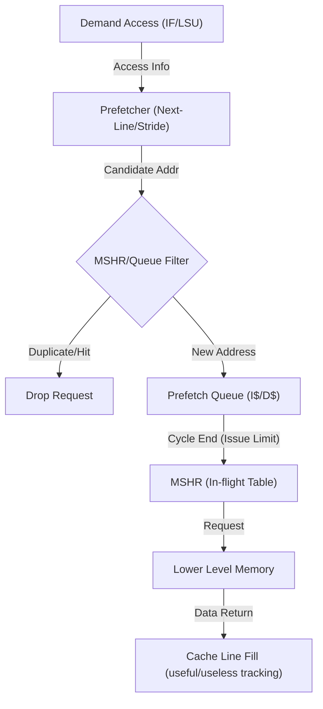

# 当前预取实现说明

这份文档描述的是 **当前仓库里已经落地的预取实现**，不是理想方案，也不是未来规划。

目标有两个：

1. 说明现在的预取框架到底是怎么工作的
2. 说明如果后续要继续改，应该从哪里改、按什么顺序改

## 1. 核心架构适配

在当前的模块化架构中，预取器不再通过 `TraceSim` 类直接调用，而是作为指令流和数据流的“旁路监测器”运行：

- **Frontend (指令预取)**：当取指级完成对 `icache` 的访问后，会触发 `icache_prefetcher`。如果满足预取条件，请求将进入 `icache_prefetch_queue`。
- **LoadStoreUnit (数据预取)**：当后端派发 Load 指令并访问 `dcache` 后，会触发 `dcache_prefetcher`。请求进入 `dcache_prefetch_queue`。

这种设计使得预取逻辑与执行逻辑完全解耦，预取器的运行不会阻塞核心流水线级次。

## 2. 当前实现到什么程度

现在的模拟器已经具备下面这些能力：

- 有状态 cache，不再是纯 hit/miss 延迟函数
- 支持可插拔 replacement policy
- 支持可插拔 prefetcher
- demand miss 不再立即 fill，而是进入 in-flight，未来某个 cycle 返回
- prefetch 也走和 demand 相同的基本 request/fill 路径
- demand 可以 merge 到已有 in-flight request
- 有最基础的 prefetch queue
- 已支持：
  - `none`
  - `next-line`
  - `pc-stride`

但当前实现仍然是“最小可用版”，还不是完整的 ChampSim 风格 memory system。当前还没有：

- 独立的 prefetch MSHR 配额
- 更精细的 late/timeliness 定义
- prefetch accuracy / coverage / traffic overhead 派生指标
- 多级 cache 协同预取策略

## 2. 相关文件

当前预取相关代码主要在这些文件里：

- [`trace_sim/Prefetcher.h`](/home/tututu/TraceSim/trace_sim/Prefetcher.h)
  - 预取器接口
  - `NextLinePrefetcher`
  - `PcStridePrefetcher`
- [`trace_sim/Cache.h`](/home/tututu/TraceSim/trace_sim/Cache.h)
  - cache line metadata
  - in-flight request tracking
  - fill / merge / prefetch 统计
- [`trace_sim/TraceSim.h`](/home/tututu/TraceSim/trace_sim/TraceSim.h)
  - cache 构造
  - prefetch queue
  - request/fill helper
  - 统计输出
- [`trace_sim/TraceSim.cpp`](/home/tututu/TraceSim/trace_sim/TraceSim.cpp)
  - load path / fetch path 调用 prefetch 和 memory request
- [`trace_sim/SimConfig.h`](/home/tututu/TraceSim/trace_sim/SimConfig.h)
  - 预取器类型配置
  - queue 大小
  - MSHR 大小
  - 每周期发出的 prefetch 数量

## 3. 当前预取整体流程



当前流程可以概括为：

1. demand 访问 I$ 或 D$
2. cache 判断：
   - `HIT`
   - `MISS_NEW`
   - `MISS_MERGED`
   - `MISS_BLOCKED`
   - `PREFETCH_DROPPED`
3. 如果访问完成，`TraceSim` 会把这次访问信息送给 prefetcher
4. prefetcher 只产出“候选预取地址”
5. 候选地址进入 I$/D$ 各自的 prefetch queue
6. 周期末 `service_prefetch_queues()` 再真正发 prefetch request
7. prefetch request 进入 cache / LLC / in-flight tracking
8. 等 `ready_cycle` 到了，`process_cache_returns()` 才真正 fill line

关键点：

- 预取器本身 **不会直接改 cache**
- cache / memory system 决定预取请求能不能真正发出去
- line 返回前，不会被视为已在 cache 中

## 4. 当前 cache 是怎么支持预取的

### 4.1 Cache line metadata

在 [`trace_sim/Cache.h`](/home/tututu/TraceSim/trace_sim/Cache.h) 里，`Cache::Line` 现在除了 `tag/valid` 之外，还带了：

- `prefetched`
- `used_by_demand`
- `fill_cycle`
- `last_access`
- `insertion_time`

这些字段的含义：

- `prefetched`
  - 这一行是不是由 prefetch fill 回来的
- `used_by_demand`
  - 如果这行是 prefetched 的，它后来有没有真的被 demand 用到
- `fill_cycle`
  - 这行在哪个周期被装入 cache

基于这些字段，现在已经能统计：

- `useful_prefetch_count`
- `useless_prefetch_count`

规则是：

- demand 命中一个 `prefetched && !used_by_demand` 的 line：
  - 记 `useful_prefetch`
- eviction 一个 `prefetched && !used_by_demand` 的 line：
  - 记 `useless_prefetch`

### 4.2 In-flight request

`Cache` 里有：

```cpp
std::unordered_map<uint32_t, InflightRequest> inflight;
```

当前 `InflightRequest` 包含：

- `block_addr`
- `ready_cycle`
- `is_prefetch`
- `has_demand_waiter`

这意味着当前已经能表示：

- 哪个 block 正在途
- 它什么时候回来
- 它最初是不是 prefetch 发起的
- 后来有没有 demand merge 到它上面

### 4.3 Access status

`Cache::request()` 现在不会只返回 hit/miss，而是会返回：

- `HIT`
- `MISS_NEW`
- `MISS_MERGED`
- `MISS_BLOCKED`
- `PREFETCH_DROPPED`

这些状态的作用：

- `HIT`
  - block 已经在 cache 中
- `MISS_NEW`
  - 没命中，且没有已有 in-flight，需要新发请求
- `MISS_MERGED`
  - 没命中，但已经有同 block in-flight，请求被 merge
- `MISS_BLOCKED`
  - demand 想发 miss，但 MSHR 满了
- `PREFETCH_DROPPED`
  - prefetch 想发 miss，但资源不够，被丢弃

### 4.4 Future return fill

现在 line 的 fill 不是在 miss 当场完成，而是：

1. `schedule_fill(addr, ready_cycle, is_prefetch)`
2. 周期推进
3. `process_returns(current_cycle)`
4. 到点后 `fill_block(...)`

这比最早的版本更真实，因为：

- 在途 line 不会被提前当成 hit
- late prefetch 和 merge 才有意义

## 5. 当前 prefetcher 接口

现在的 prefetcher 接口在 [`trace_sim/Prefetcher.h`](/home/tututu/TraceSim/trace_sim/Prefetcher.h)。

核心输入结构：

```cpp
struct PrefetcherAccessInfo {
    uint32_t pc = 0;
    uint32_t addr = 0;
    uint32_t line_size = 0;
    bool is_instruction = false;
    bool is_load = false;
    bool is_store = false;
    bool hit = false;
    bool miss = false;
};
```

输出结构：

```cpp
struct PrefetchRequest {
    uint32_t addr = 0;
};
```

接口：

```cpp
virtual void on_access(const PrefetcherAccessInfo &info,
                       std::vector<PrefetchRequest> &requests) = 0;
```

这意味着预取器现在可以看到：

- 触发这次访问的 `PC`
- 访问地址
- line size
- 是 I$ 访问还是 D$ 访问
- 是 hit 还是 miss

这已经足够支持：

- `next-line`
- 基础 `PC-based stride`

## 6. 当前内置的预取器

### 6.1 NullPrefetcher

什么都不做。

用途：

- 作为系统基线
- 验证开启预取后的收益是不是来自策略本身

### 6.2 NextLinePrefetcher

逻辑很简单：

- 对当前访问地址按 cache line 对齐
- 预取下一条 line

适合：

- 验证整个 prefetch framework 是否工作
- 顺序访问流的基础实验

不适合：

- 真正复杂的访存模式比较

### 6.3 PcStridePrefetcher

当前实现是一个最小原型：

- 用 `PC` 做 key
- 为每个 `PC` 记录：
  - `last_line_addr`
  - `last_stride`
  - `confidence`
- 当同一个 stride 连续出现几次后，发出：
  - `next_line_addr = current_line_addr + stride`

当前特点：

- 很保守
- 只发一阶 stride
- confidence 固定写死在实现里

这个版本的目的主要是：

- 验证接口是够用的
- 证明系统已经能支持 PC-aware prefetcher

## 7. 当前 prefetch queue 是怎么工作的

I$ 和 D$ 现在各有一个 queue：

- `icache_prefetch_queue`
- `dcache_prefetch_queue`

当前行为：

1. demand 访问结束后，调用 `enqueue_prefetches(...)`
2. prefetcher 返回候选地址
3. 候选地址先做 queue 内去重
4. 如果 queue 满则丢弃
5. 周期末 `service_prefetch_queues()` 再按配置发出有限个 prefetch

对应配置在 [`trace_sim/SimConfig.h`](/home/tututu/TraceSim/trace_sim/SimConfig.h)：

- `ICACHE_PREFETCH_QUEUE_SIZE`
- `DCACHE_PREFETCH_QUEUE_SIZE`
- `ICACHE_PREFETCH_ISSUE_PER_CYCLE`
- `DCACHE_PREFETCH_ISSUE_PER_CYCLE`

这个设计的意义：

- 预取不再和 demand 同时零成本发起
- demand 先走，prefetch 后走
- 能开始观察 queue duplicate / queue drop

## 8. 当前已经有的预取统计

当前输出里已经能看到这些统计：

- `issued`
- `filtered_hit`
- `queue_dup`
- `queue_drop`
- `filtered_inflight`
- `dropped`
- `fills`
- `miss_new`
- `miss_merged`
- `miss_blocked`
- `merged_with_prefetch`
- `late`
- `useful`
- `useless`

这些字段大致含义：

- `issued`
  - 真正进入 cache request 路径的 prefetch 数量
- `filtered_hit`
  - prefetch 发起时发现 line 已在 cache 中
- `queue_dup`
  - 候选地址在 prefetch queue 中重复
- `queue_drop`
  - prefetch queue 满，候选地址被丢弃
- `filtered_inflight`
  - 候选地址对应 block 已经在 in-flight 中
- `dropped`
  - prefetch 想发 miss，但 MSHR 满，被丢弃
- `fills`
  - 真正由 prefetch 填入 cache 的 line 数量
- `miss_new`
  - demand 的全新 miss
- `miss_merged`
  - demand merge 到已有 in-flight request
- `miss_blocked`
  - demand 因资源不足被阻塞
- `merged_with_prefetch`
  - demand merge 到由 prefetch 发起的 in-flight request
- `late`
  - 当前实现里，merge 到 prefetch in-flight 就记为 late
- `useful`
  - prefetched line 后来被 demand 使用
- `useless`
  - prefetched line 在未被 demand 使用前被替换掉

## 9. 当前实现的限制

当前实现已经比最开始可信很多，但还存在这些限制：

### 9.1 late 定义还比较粗

现在的 `late_prefetch` 定义是：

- 只要 demand merge 到已有 prefetch in-flight，就算 late

这比“完全没 late 统计”要强，但还不够精细。

更合理的后续方向是：

- 区分：
  - 预取已经 fill，demand hit 到 line
  - 预取在途，demand merge 等待
  - 预取太晚，根本没帮上忙

### 9.2 还没有 accuracy / coverage / traffic overhead 派生指标

当前输出的是原始计数。

后续推荐直接补：

- `prefetch_accuracy = useful / issued`
- `prefetch_coverage = useful / demand_miss_baseline_or_current`
- `traffic_overhead = extra_llc_or_dram_reads / baseline_reads`

### 9.3 stride prefetcher 还是最小原型

现在的 `PcStridePrefetcher` 还没有：

- 可配置 table size
- 可配置 confidence threshold
- degree > 1
- page boundary 控制
- 训练过滤策略

### 9.4 还没有更细的资源隔离

目前只做了：

- MSHR 上限
- prefetch queue 上限
- demand 优先于 prefetch 的发起时序

还没有：

- demand 和 prefetch 独立配额
- 多级 queue
- 更细粒度的仲裁策略

## 10. 如果你要继续改，应该怎么改

推荐顺序如下。

### 第一优先级：补统计，不动太多行为

适合你现在这种“改动太多，先收口”的阶段。

建议先做：

1. 加 accuracy / coverage / traffic overhead 派生指标
2. 把 `late` 定义再收紧
3. 文档同步更新

推荐修改位置：

- [`trace_sim/TraceSim.h`](/home/tututu/TraceSim/trace_sim/TraceSim.h)

### 第二优先级：把 stride prefetcher 做成真正可调参数化版本

建议加到 [`trace_sim/SimConfig.h`](/home/tututu/TraceSim/trace_sim/SimConfig.h)：

- stride table size
- confidence threshold
- max confidence
- degree

推荐修改位置：

- [`trace_sim/Prefetcher.h`](/home/tututu/TraceSim/trace_sim/Prefetcher.h)

### 第三优先级：继续增强资源建模

如果你后面要认真比较不同 prefetcher，这一步才值得做。

建议做：

- prefetch queue 和 demand path 更细的仲裁
- prefetch 专属 MSHR 预算
- page boundary 规则
- 预取请求的下层流量统计

推荐修改位置：

- [`trace_sim/Cache.h`](/home/tututu/TraceSim/trace_sim/Cache.h)
- [`trace_sim/TraceSim.h`](/home/tututu/TraceSim/trace_sim/TraceSim.h)

## 11. 如果你想新增一个自己的预取器，怎么做

最简单的方法：

1. 在 [`trace_sim/Prefetcher.h`](/home/tututu/TraceSim/trace_sim/Prefetcher.h) 里新增类，继承 `CachePrefetcher`
2. 实现：

```cpp
const char *name() const override;
void on_access(const PrefetcherAccessInfo &info,
               std::vector<PrefetchRequest> &requests) override;
```

3. 在 `make_*prefetcher()` 工厂里加构造函数
4. 在 [`trace_sim/SimConfig.h`](/home/tututu/TraceSim/trace_sim/SimConfig.h) 的 `PrefetcherType` 里加枚举值
5. 在 [`trace_sim/TraceSim.h`](/home/tututu/TraceSim/trace_sim/TraceSim.h) 的 `make_prefetcher()` 里接进去

示意：

```cpp
class MyPrefetcher : public CachePrefetcher {
public:
    const char *name() const override { return "my-prefetcher"; }

    void on_access(const PrefetcherAccessInfo &info,
                   std::vector<PrefetchRequest> &requests) override {
        // 根据 info.pc / info.addr / info.hit / info.is_load
        // 决定要不要 push 预取地址
    }
};
```

注意：

- 预取器只应该返回候选地址
- 不要在 prefetcher 里直接改 cache line
- 去重、过滤、drop、MSHR、return path 都应该留给 cache/memory 子系统处理

## 12. 当前默认配置

为了避免把仓库长期留在某个实验配置上，当前默认配置仍然是：

- `ICACHE_PREFETCHER = NONE`
- `DCACHE_PREFETCHER = NONE`
- `LLC_PREFETCHER = NONE`

如果你想临时测试：

- `next-line`
- `pc-stride`

直接改 [`trace_sim/SimConfig.h`](/home/tututu/TraceSim/trace_sim/SimConfig.h) 里的对应项即可。

## 13. 当前建议的使用方式

如果你现在要做基础实验，建议按这个顺序：

1. 跑 `NONE` 基线
2. 跑 `NEXT_LINE`
3. 跑 `STRIDE`
4. 对比：
   - IPC
   - `miss_new`
   - `miss_merged`
   - `merged_with_prefetch`
   - `late`
   - `useful`
   - `useless`
   - `queue_dup`
   - `queue_drop`
   - LLC 访问数

如果某个预取器出现：

- `issued` 很大
- `useful` 很小
- `queue_dup` 很大
- `filtered_hit` 很大

通常说明：

- 策略太激进
- 或者该 workload 本来不需要那么多预取

这就是当前这套框架最适合帮助你观察的东西。

## 14. 术语表

### demand

`demand` 指的是程序当前真正需要的访存请求。

例如：

- CPU 取下一条指令时发出的 I$ 访问
- 一条 load 指令为了拿到数据而发出的 D$ 访问

它和 `prefetch` 的区别是：

- `demand`
  - 现在就必须服务，否则程序走不下去
- `prefetch`
  - 提前猜测将来可能会用到，所以先去取

更准确的中文表达建议是：

- `demand request` = `真实访存请求`
- `prefetch request` = `预取请求`

### prefetch

`prefetch` 是预取器根据历史访存模式，提前发出的投机性访存请求。

目标是：

- 在 demand 真正到来前，把 line 提前带到更近一级的 cache

当前实现里：

- prefetch 不会直接改 cache
- prefetch 会先进 prefetch queue
- 然后通过和 demand 类似的 request/fill 路径进入 memory system

### trigger

这里的 `trigger` 指“什么事件会让预取器运行一次”。

在当前实现里：

- 一次 demand 访问结束后，会把该次访问信息送给 prefetcher
- 由 prefetcher 决定是否生成候选预取地址

所以更准确地说：

- demand 访问触发 prefetcher 运行
- prefetcher 再决定是否产生命中候选地址

### training

`training` 指的是：

- 预取器根据已经发生过的访存行为
- 更新自己的内部状态
- 让以后能更准确地预测未来地址

例如对 stride prefetcher：

- 记录某个 `PC` 上一次访问的 line
- 计算这次和上次的 stride
- 更新 stride 置信度

这里“记录地址、更新 stride、提高或降低 confidence”的过程，就是训练。

训练和发起预取不是一回事：

- `training` = 学规律
- `issue prefetch` = 根据规律决定要不要发请求

### MSHR

`MSHR` 可以理解成：

- miss handling status register
- 或者更通俗一点：`在途 miss 表`

它记录的是：

- 哪个 block 正在途
- 它什么时候回来
- 是 demand 发起的还是 prefetch 发起的
- 后续有没有其他请求 merge 到它上面

在当前实现里：

- `Cache::inflight`
  - 就是当前简化版的 MSHR / miss table

当前 demand 和 prefetch 共享这张表。

### merge

`merge` 指的是：

- 某个 block 已经有一个 in-flight 请求了
- 后续同一个 block 的请求不再重新发一次
- 而是挂到已有请求上等待返回

这就叫 merge。

当前实现里常见两种：

- demand merge 到 demand
- demand merge 到 prefetch

后一种就是统计里的：

- `merged_with_prefetch`

### late prefetch

`late prefetch` 指的是：

- 预取虽然发了
- 但 demand 到来时，这个预取还没完成
- demand 只能 merge 等待，而不是直接 hit 到预取回来的 line

当前实现里，`late` 的定义还是最小版：

- 只要 demand merge 到 prefetch in-flight，就记为 late

这比完全没有 late 统计好，但还不是最细粒度定义。

### useful prefetch

`useful prefetch` 指的是：

- 一条由 prefetch 带回来的 line
- 后来真的被 demand 使用到了

当前实现里：

- demand 命中一个 `prefetched && !used_by_demand` 的 line
- 就记一次 `useful`

### useless prefetch

`useless prefetch` 指的是：

- 一条由 prefetch 带回来的 line
- 在真正被 demand 使用前
- 就已经被替换掉了

当前实现里：

- eviction 一个 `prefetched && !used_by_demand` 的 line
- 就记一次 `useless`

### hit / miss

这里的 hit / miss 说的是某次 cache 访问的结果：

- `hit`
  - block 已经在 cache 中
- `miss`
  - block 不在 cache 中，需要依赖下一级或内存返回

在当前实现里，cache 访问不会只返回简单的 hit/miss，而是更细：

- `HIT`
- `MISS_NEW`
- `MISS_MERGED`
- `MISS_BLOCKED`
- `PREFETCH_DROPPED`

这是为了让 memory system 行为比“纯固定延迟”更真实。
