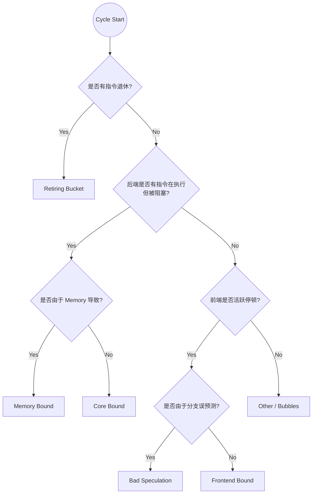

# TraceSim Top-Down 归因指南 (Level 1 & 2)

TraceSim 采用了业界标准的 Top-Down 性能分析模型，通过将每周期的处理器状态归类到不同的“桶 (Bucket)”中，量化由于取指、后端执行、数据依赖或分支误预测导致的性能损失。

## 1. 判定优先级逻辑

当模拟器推进到每一拍结束时，`Profiler` 会通过以下优先级逻辑对该周期进行归因：

## 2. Bucket 详细定义

### 2.1 Retiring (有效执行)
- **定义**: 至少有一条指令成功退休。
- **含义**: 处理器正在执行有用的工作。这并不意味着达到了 100% 的效率，但在周级粗粒度归因中，这被视为有效周期。

### 2.2 Bad Speculation (误预测惩罚)
- **定义**: 该周期没有任何退休，且前端处于由于 **分支预测错误** (`BRANCH_MISPREDICT`) 导致的刷新/停顿状态中。
- **指示器**: 反映了分支预测器不够精准带来的流水线开销。

### 2.3 Frontend Bound (前端局限)
- **定义**: 该周期无退休，且前端处于 **活跃停顿**（除误预测外，如 `ICACHE_MISS`, `LINE_BOUNDARY`）。或是后端有资源可用，但前端提供的指令填不满 Dispatch 带宽。
- **优化点**: 增大 I-Cache 命中率、优化指令缓冲区大小、提高取指带宽或对齐策略。

### 2.4 Backend Bound (后端局限)
- **分类**:
    - **Memory Bound**: 当 ROB 头部指令（Head）正在等待 L1-D Cache 或主存的数据返回。这通常与 Cache Hit Rate 相关。
    - **Core Bound**: 后端资源（ROB/IQ）已满，或者是因为 **数据依赖（Data-flow Dependency）** 导致指令即使在 IQ 中也无法发射。
- **优化点**: 增加 ROB/IQ 容量、增加执行单元数量、优化调度器逻辑、或引入预取器（针对 Memory Bound）。

## 3. 如何使用归因数据进行优化？

| 当观察到以下现象... | 建议尝试的优化方案 |
| :--- | :--- |
| **Frontend Bound 占比过高** | 确认 I-Cache 大小是否不足；尝试通过对齐优化减少跨行停顿。 |
| **Core Bound 占比过高** | 检查指令间的数据依赖是否过密；尝试增加发射宽度或 ALU 数量。 |
| **Memory Bound 占比过高** | 提高 D-Cache 大小或相联度；检查 STLF 效率；**开启预取器 (Prefetcher)**。 |
| **Bad Speculation 占比过高** | 升级分支预测算法（如从静态切换到 Gshare）。 |

---
> [!TIP]
> 真实的处理器调优通常是先看宏观的 Top-down 比例，锁定瓶颈模块后，再通过微观统计（如 Cache Hit Rate, BP Accuracy）定位具体根因。
